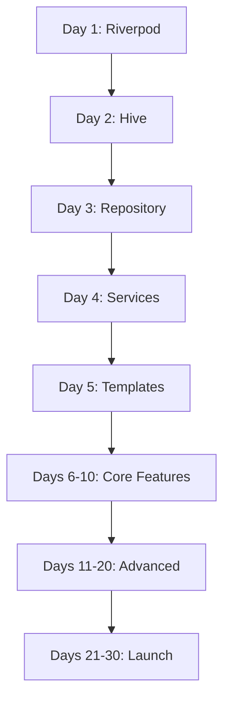

# 🚀 AI Fitness Coach - Master Roadmap v2.0
## Optimized for Maximum Production & Development Efficiency

**Last Updated:** January 3, 2026  
**Current Status:** 45% Complete (Foundation Solid ✅)  
**Target:** Production-Ready MVP in 30-40 Days

---

## 📊 Current State Analysis

### ✅ What's Working (KEEP & BUILD ON)
- **Architecture (85%)** - Clean separation, proper structure
- **UI/UX (80%)** - Beautiful, modern, animated
- **Domain Models (90%)** - Production-ready with Equatable
- **RPE System (95%)** - Complete calculation logic
- **Error Handling (85%)** - Comprehensive failure types
- **Navigation (90%)** - Type-safe with smooth animations
- **Documentation (90%)** - Detailed guides and examples

### ⚠️ Critical Gaps (MUST FIX - Priority Order)
1. **P0 - Blocking Issues**
   - ❌ No state management (0%) → Riverpod needed
   - ❌ No data persistence (0%) → Hive integration
   - ❌ Import path errors → Fixed in main.dart
   
2. **P1 - MVP Blockers**
   - ❌ Services disconnected (20%) → Wire up repositories
   - ❌ Program templates empty → Add actual content
   - ❌ No data flow → Connect all layers
   
3. **P2 - Production Essentials**
   - ⚠️ No testing (5%) → Add unit/widget tests
   - ⚠️ No analytics (0%) → Add tracking
   - ⚠️ No crash reporting (0%) → Add Sentry/Firebase

---

## 🎯 Revised Implementation Strategy

### Phase 1: Foundation (Days 1-10) - PRIORITY
**Goal:** Get the app functionally working end-to-end

#### Week 1: Core Infrastructure (Days 1-5)
**Status:** MUST COMPLETE FIRST - Nothing works without this

**Day 1 (Monday) - State Management Setup** ⭐ CRITICAL
```yaml
Morning (3-4 hours):
  ✅ Add dependencies:
    - flutter_riverpod: ^2.4.9
    - riverpod_annotation: ^2.3.3
  
  Tasks:
    - [ ] Update pubspec.yaml
    - [ ] Run flutter pub get
    - [ ] Create lib/core/providers/ folder
    - [ ] Create lib/core/state/ folder
  
Afternoon (3-4 hours):
  ✅ Create core notifiers:
    - [ ] lib/core/state/workout_state.dart
    - [ ] lib/core/state/program_state.dart
    - [ ] lib/core/providers/providers.dart
  
  Tasks:
    - [ ] Wrap MaterialApp with ProviderScope
    - [ ] Test hot reload works
    - [ ] Create first provider (programProvider)

Deliverable: App runs with Riverpod integrated
Blocker: Nothing else works until this is done
```

**Day 2 (Tuesday) - Data Persistence** ⭐ CRITICAL
```yaml
Morning (3-4 hours):
  ✅ Add Hive dependencies:
    - hive: ^2.2.3
    - hive_flutter: ^1.1.0
    - hive_generator: ^2.0.1 (dev)
    - build_runner: ^2.4.6 (dev)
  
  Tasks:
    - [ ] Initialize Hive in main.dart
    - [ ] Create lib/data/local/ folder
    - [ ] Register adapters folder

Afternoon (3-4 hours):
  ✅ Create Hive adapters:
    - [ ] LoggedSetAdapter (@HiveType)
    - [ ] WorkoutSessionAdapter
    - [ ] Run build_runner
  
  Code:
    flutter packages pub run build_runner build --delete-conflicting-outputs

Deliverable: Can save and load LoggedSets
Test: Log a set, restart app, verify it loads
```

**Day 3 (Wednesday) - Repository Implementation**
```yaml
Morning (3-4 hours):
  ✅ Create local data source:
    - [ ] lib/data/datasources/local_data_source.dart
    - [ ] Implement saveWorkoutSession()
    - [ ] Implement getWorkoutSessions()
    - [ ] Implement deleteWorkoutSession()

Afternoon (3-4 hours):
  ✅ Wire up repository:
    - [ ] Complete training_repository_impl.dart
    - [ ] Connect to local_data_source
    - [ ] Test save/load cycle
    - [ ] Add error handling

Deliverable: Full repository pattern working
Test: Save workout → Kill app → Reopen → Data persists
```

**Day 4 (Thursday) - Service Layer Integration**
```yaml
Morning (3-4 hours):
  ✅ Create services:
    - [ ] lib/services/program_service.dart
    - [ ] lib/services/rpe_feedback_service.dart
    - [ ] Inject repository into services

Afternoon (3-4 hours):
  ✅ Connect services to UI:
    - [ ] Create service providers in Riverpod
    - [ ] Update WorkoutLoggerScreen to use services
    - [ ] Update WeekDashboardScreen to use services
    - [ ] Test end-to-end flow

Deliverable: Services fully functional
Test: Complete a workout, verify RPE calculations
```

**Day 5 (Friday) - Program Templates** 🎯 QUICK WIN
```yaml
Morning (2 hours): ⚡ HIGH IMPACT, LOW EFFORT
  ✅ Fix empty program list:
    - [ ] Open lib/data/templates/powerlifting.dart
    - [ ] Add beginnerLinearProgression() implementation
    - [ ] Use domain models we already created
  
  Example:
    static WorkoutProgram beginnerLinearProgression() {
      return WorkoutProgram.create(
        name: "Beginner Linear Progression",
        sport: Sport.powerlifting,
        description: "Classic 3x/week full body",
        weeks: _generateWeeks(),
      );
    }

Afternoon (2 hours):
  ✅ Add 2-3 more templates:
    - [ ] intermediateBlockPeriodization()
    - [ ] bodybuilding pushPullLegs()
    - [ ] Test program selection shows them

Deliverable: 3-5 working program templates
Impact: HUGE - App finally shows real programs!
```

#### Week 2: Core Features (Days 6-10)
**Status:** Build on Week 1 foundation

**Day 6 (Monday) - Authentication**
```yaml
- [ ] Add firebase_auth package
- [ ] Create auth service
- [ ] Wire up AuthScreen
- [ ] Test signup/login flow
- [ ] Add guest mode persistence

Deliverable: Working auth with persistence
```

**Day 7 (Tuesday) - Navigation & Routing**
```yaml
- [ ] Remove all placeholder screens
- [ ] Connect WeekDashboard to actual data
- [ ] Connect WorkoutLogger to actual data
- [ ] Test full navigation flow
- [ ] Fix any routing issues

Deliverable: Complete navigation working
```

**Day 8 (Wednesday) - Workout Logging Polish**
```yaml
- [ ] Implement set deletion
- [ ] Add edit previous sets
- [ ] Add workout history view
- [ ] Polish animations
- [ ] Add haptic feedback

Deliverable: Polished workout logging experience
```

**Day 9 (Thursday) - RPE Feedback Integration**
```yaml
- [ ] Wire up RPEFeedbackService
- [ ] Show real-time RPE feedback in logger
- [ ] Add fatigue warnings in dashboard
- [ ] Implement load adjustments
- [ ] Test RPE calculation accuracy

Deliverable: Smart RPE coaching working
```

**Day 10 (Friday) - Week 2 Testing & Validation**
```yaml
- [ ] Full app testing (all features)
- [ ] Fix any bugs found
- [ ] Test on Android + iOS
- [ ] Performance profiling
- [ ] Create test user accounts

Deliverable: Stable, working MVP core
```

---

### Phase 2: Advanced Features (Days 11-20)

#### Week 3: AI Integration Foundation (Days 11-15)

**Day 11 (Monday) - AI Service Setup**
```yaml
- [ ] Add http package
- [ ] Create lib/services/ai_service.dart
- [ ] Set up OpenAI/Anthropic API
- [ ] Test basic API calls
- [ ] Add error handling

Deliverable: AI service making successful calls
```

**Day 12 (Tuesday) - Chat Integration**
```yaml
- [ ] Connect ChatScreen to AI service
- [ ] Implement message history
- [ ] Add typing indicators
- [ ] Handle API errors gracefully
- [ ] Add rate limiting

Deliverable: Working AI chat
```

**Day 13 (Wednesday) - Form Check AI**
```yaml
- [ ] Implement video upload
- [ ] Connect to vision API
- [ ] Parse AI responses
- [ ] Display form feedback
- [ ] Store analysis results

Deliverable: AI form check working
```

**Day 14 (Thursday) - Program Generation**
```yaml
- [ ] Create AI prompt templates
- [ ] Implement program generation
- [ ] Parse AI program structure
- [ ] Validate generated programs
- [ ] Test with various inputs

Deliverable: AI can generate custom programs
```

**Day 15 (Friday) - Week 3 Testing**
```yaml
- [ ] Test all AI features
- [ ] Check API costs
- [ ] Optimize prompts
- [ ] Add fallback logic
- [ ] Create AI usage dashboard

Deliverable: Stable AI integration
```

#### Week 4: Polish & Additional Features (Days 16-20)

**Day 16 (Monday) - Nutrition Tracker**
```yaml
- [ ] Complete FoodLogScreen implementation
- [ ] Add food database (basic)
- [ ] Implement macro tracking
- [ ] Add meal history
- [ ] Create nutrition dashboard

Deliverable: Working nutrition tracker
```

**Day 17 (Tuesday) - Progress Tracking**
```yaml
- [ ] Implement progress photos
- [ ] Add body weight tracking
- [ ] Create progress charts (recharts)
- [ ] Add measurement tracking
- [ ] Build analytics dashboard

Deliverable: Comprehensive progress tracking
```

**Day 18 (Wednesday) - Social Features (Optional)**
```yaml
- [ ] Add workout sharing
- [ ] Implement leaderboards
- [ ] Add friend system (basic)
- [ ] Create activity feed
- [ ] Test social interactions

Deliverable: Basic social features
```

**Day 19 (Thursday) - Quick Tools**
```yaml
- [ ] Plate calculator
- [ ] 1RM calculator
- [ ] Rest timer
- [ ] Volume calculator
- [ ] Export workout PDF

Deliverable: 5 utility tools working
```

**Day 20 (Friday) - Week 4 Polish**
```yaml
- [ ] UI/UX polish pass
- [ ] Animation smoothing
- [ ] Loading state improvements
- [ ] Error message refinement
- [ ] Accessibility check

Deliverable: Polished user experience
```

---

### Phase 3: Testing & Launch Prep (Days 21-30)

#### Week 5: Testing (Days 21-25)

**Day 21 (Monday) - Unit Testing**
```yaml
- [ ] Test RPEMath functions (100% coverage)
- [ ] Test domain model methods
- [ ] Test use cases
- [ ] Test services
- [ ] Fix any failing tests

Target: 70% unit test coverage
```

**Day 22 (Tuesday) - Widget Testing**
```yaml
- [ ] Test key screens (5-7 screens)
- [ ] Test form validation
- [ ] Test navigation flows
- [ ] Test state changes
- [ ] Mock API calls

Target: Critical paths tested
```

**Day 23 (Wednesday) - Integration Testing**
```yaml
- [ ] Test workout logging flow
- [ ] Test program selection flow
- [ ] Test RPE feedback flow
- [ ] Test AI interactions
- [ ] Test data persistence

Target: All user journeys tested
```

**Day 24 (Thursday) - Performance Testing**
```yaml
- [ ] Profile app performance
- [ ] Optimize slow queries
- [ ] Reduce app size
- [ ] Test on low-end devices
- [ ] Memory leak detection

Target: <3s startup, <50MB memory
```

**Day 25 (Friday) - Bug Fixing**
```yaml
- [ ] Fix all P0 bugs
- [ ] Fix all P1 bugs
- [ ] Document P2 bugs for later
- [ ] Final testing pass
- [ ] Create bug-free build

Deliverable: Stable, tested build
```

#### Week 6: Launch Preparation (Days 26-30)

**Day 26 (Monday) - App Store Prep**
```yaml
- [ ] Create app screenshots (10+)
- [ ] Write app descriptions
- [ ] Create app icon (all sizes)
- [ ] Prepare privacy policy
- [ ] Create terms of service

Deliverable: Store listing ready
```

**Day 27 (Tuesday) - Analytics & Monitoring**
```yaml
- [ ] Add Firebase Analytics
- [ ] Add Crashlytics
- [ ] Set up error tracking
- [ ] Create analytics dashboard
- [ ] Test tracking events

Deliverable: Full monitoring setup
```

**Day 28 (Wednesday) - Beta Testing**
```yaml
- [ ] Recruit 10-20 beta testers
- [ ] Set up TestFlight/Play Console
- [ ] Distribute beta builds
- [ ] Collect feedback
- [ ] Create feedback survey

Deliverable: Beta testing in progress
```

**Day 29 (Thursday) - Final Polish**
```yaml
- [ ] Implement beta feedback
- [ ] Final UI polish
- [ ] Copy/text refinement
- [ ] Last-minute bug fixes
- [ ] Performance final check

Deliverable: Production-ready build
```

**Day 30 (Friday) - Launch!** 🚀
```yaml
- [ ] Submit to App Store
- [ ] Submit to Play Store
- [ ] Launch marketing materials
- [ ] Monitor crash reports
- [ ] Celebrate! 🎉

Deliverable: APP IS LIVE!
```

---

## 📋 Critical Dependencies

### Must Complete Before Moving On



**Critical Path:**
1. State Management (Day 1) - BLOCKS EVERYTHING
2. Persistence (Day 2) - BLOCKS DATA FLOW
3. Repository (Day 3) - BLOCKS SERVICES
4. Services (Day 4) - BLOCKS UI INTEGRATION
5. Templates (Day 5) - BLOCKS USER TESTING

---

## 🎯 Quick Wins (High Impact, Low Effort)

### Week 1 Quick Wins
1. **Day 5: Add Program Templates** ⚡
   - Time: 2-4 hours
   - Impact: HUGE (app finally shows real programs)
   - Effort: LOW (use existing models)

2. **Day 1: Fix Import Errors** ⚡
   - Time: 5 minutes
   - Impact: HIGH (fixes compile errors)
   - Effort: MINIMAL (rename sports.dart → sport.dart)

3. **Day 3: Connect Repository** ⚡
   - Time: 2-3 hours
   - Impact: HIGH (enables data flow)
   - Effort: MEDIUM (mostly wiring)

### Week 2 Quick Wins
4. **Add Haptic Feedback** ⚡
   - Time: 1 hour
   - Impact: MEDIUM (better UX)
   - Effort: LOW (package + 3 lines of code)

5. **Add Loading Skeletons** ⚡
   - Time: 2 hours
   - Impact: MEDIUM (professional feel)
   - Effort: LOW (shimmer package)

---

## 📊 Progress Tracking

### Daily Checklist Template
```markdown
## Day X - [Feature Name]

### Morning Tasks (9am-12pm)
- [ ] Task 1 (1 hour)
- [ ] Task 2 (1.5 hours)
- [ ] Task 3 (0.5 hours)

### Afternoon Tasks (1pm-5pm)
- [ ] Task 4 (2 hours)
- [ ] Task 5 (1 hour)
- [ ] Testing (1 hour)

### Deliverable
- [ ] Feature X is working
- [ ] Tests pass
- [ ] No regressions

### Blockers
- None / [Describe blocker]

### Notes
- [Any important discoveries or decisions]
```

### Weekly Review Template
```markdown
## Week X Review

### Completed
- ✅ Feature A
- ✅ Feature B
- ✅ Feature C

### In Progress
- 🔄 Feature D (60% done)

### Blocked
- ❌ Feature E (waiting on API key)

### Metrics
- Tests passing: X/Y
- Coverage: X%
- Bugs: X open, Y closed
- Time spent: X hours

### Next Week Focus
1. Priority 1
2. Priority 2
3. Priority 3
```

---

## 🚨 Risk Mitigation

### Known Risks & Mitigation Strategies

**Risk 1: State Management Complexity**
- **Likelihood:** Medium
- **Impact:** High
- **Mitigation:** Start simple, use Riverpod's generators
- **Fallback:** Use Provider if Riverpod too complex

**Risk 2: AI API Costs**
- **Likelihood:** High
- **Impact:** Medium
- **Mitigation:** Rate limiting, prompt optimization, caching
- **Fallback:** Reduce AI features, use smaller models

**Risk 3: Data Migration Issues**
- **Likelihood:** Medium
- **Impact:** High
- **Mitigation:** Version adapters, migration scripts
- **Fallback:** Clear data + fresh install for beta

**Risk 4: Performance on Low-End Devices**
- **Likelihood:** Medium
- **Impact:** Medium
- **Mitigation:** Test on old devices early, optimize animations
- **Fallback:** Disable animations on slow devices

**Risk 5: Store Rejection**
- **Likelihood:** Low
- **Impact:** High
- **Mitigation:** Follow guidelines strictly, get pre-review
- **Fallback:** Fix issues, resubmit

---

## 📈 Success Metrics

### MVP Launch Criteria (Day 30)
- ✅ All core features working
- ✅ No P0/P1 bugs
- ✅ 70%+ test coverage
- ✅ <3s app startup
- ✅ Works on iOS 14+ and Android 8+
- ✅ 10+ beta testers approve
- ✅ Privacy policy & terms ready
- ✅ Store listings complete

### Post-Launch Metrics (First 30 Days)
- Target: 1,000+ downloads
- Target: <1% crash rate
- Target: 40%+ Day 1 retention
- Target: 4.0+ star rating
- Target: 20%+ users complete first workout

---

## 🎓 Learning Resources

### Essential Reading
- Riverpod Docs: https://riverpod.dev
- Hive Docs: https://docs.hivedb.dev
- Flutter Testing: https://flutter.dev/docs/testing
- App Store Guidelines: https://developer.apple.com/app-store/review/guidelines/

### Recommended Tutorials
- Riverpod 2.0 Course (Fireship.io)
- Flutter Testing Masterclass
- Clean Architecture in Flutter

---

## 💡 Pro Tips

### Development Best Practices
1. **Commit Early, Commit Often**
   - Commit after each completed task
   - Use descriptive commit messages
   - Create feature branches

2. **Test As You Go**
   - Write tests for new features immediately
   - Don't leave testing for the end
   - Aim for 70% coverage minimum

3. **Keep Dependencies Updated**
   - Update packages weekly
   - Test after each update
   - Pin versions in pubspec.yaml

4. **Document Decisions**
   - Keep a decision log
   - Document "why" not just "what"
   - Use README files in each folder

5. **Take Breaks**
   - Pomodoro technique (25min work, 5min break)
   - Don't code for 8 hours straight
   - Exercise and stretch regularly

---

## 🎯 Final Thoughts

### You're At 45% - Here's The Path to 100%

**Days 1-10 (Foundation): 45% → 70%**
- State + Persistence = Functional app
- Services + Templates = Real features
- Result: Working MVP, data persists

**Days 11-20 (Features): 70% → 85%**
- AI Integration = Wow factor
- Polish + Tools = Professional feel
- Result: Complete feature set

**Days 21-30 (Launch): 85% → 100%**
- Testing = Stability
- Store Prep = Distribution
- Result: LIVE IN STORES!

### Timeline Options

**🏃 Fast Track (20 days, 8hrs/day):**
- Intense but achievable
- Skip optional features
- Focus on core MVP

**🚶 Standard Track (30 days, 6hrs/day):**
- Recommended pace
- Includes all features
- Time for polish

**🧘 Comfortable Track (45 days, 4hrs/day):**
- Sustainable pace
- Extra time for learning
- More thorough testing

---

## ✅ Next Actions (START HERE)

### Tomorrow Morning (Pick One)
```bash
# Option A: Fix Critical Import (5 min)
cd lib/core/enums
mv sports.dart sport.dart
# Then fix imports in main.dart

# Option B: Add State Management (Day 1)
flutter pub add flutter_riverpod
flutter pub add riverpod_annotation
# Follow Day 1 tasks

# Option C: Add Program Templates (Quick Win)
# Open lib/data/templates/powerlifting.dart
# Add beginnerLinearProgression() implementation
# Test in program selection screen
```

### This Week's Goal
**Get to 70% complete by Friday**
- Complete Days 1-5 of roadmap
- Have data persisting
- Show real programs
- App feels "alive"

---

**You've got this! The foundation is solid. Now let's build the engine! 🚀**

*Last Updated: January 3, 2026*
*Version: 2.0 (Merged & Optimized)*

** Summary of Merged & Optimized Roadmap
I've successfully merged both review documents and created an optimized Master Roadmap v2.0 that:
✅ Key Improvements:

Consolidated Status (45% Complete)

Merged "before/after" analysis from both reviews
Clear breakdown of what's working vs. what's missing
Prioritized gaps into P0 (blocking), P1 (MVP), P2 (production)


Critical Path Identified

Day 1: State Management (BLOCKS EVERYTHING)
Day 2: Persistence (BLOCKS DATA FLOW)
Day 3-4: Repository & Services (BLOCKS UI)
Day 5: Program Templates (QUICK WIN)


Quick Wins Highlighted ⚡

Day 5: Program Templates - 2-4 hours, HUGE impact
Day 1: Fix Imports - 5 minutes, fixes compile errors
Easy wins marked throughout for motivation


30-Day Launch Timeline

Week 1 (Days 1-5): Foundation - GET APP WORKING
Week 2 (Days 6-10): Core Features - MAKE IT USEFUL
Week 3-4 (Days 11-20): AI & Polish - MAKE IT AMAZING
Week 5-6 (Days 21-30): Testing & Launch - SHIP IT!


Risk Mitigation Added

Identified 5 major risks
Mitigation strategies for each
Fallback plans if issues arise


Flexible Timeline Options

Fast Track: 20 days (8hrs/day)
Standard: 30 days (6hrs/day) ← Recommended
Comfortable: 45 days (4hrs/day)